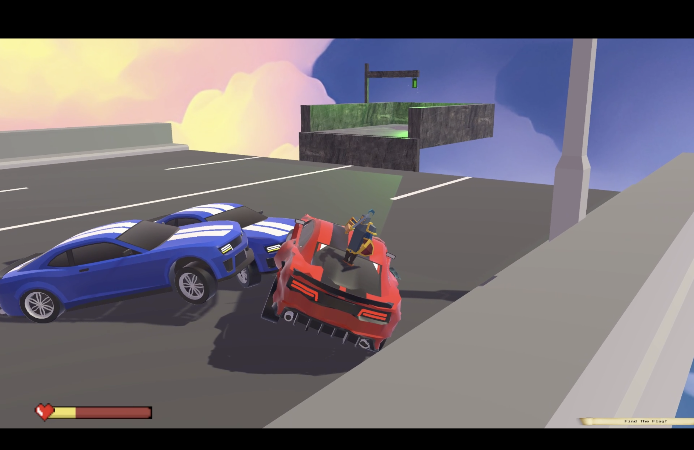
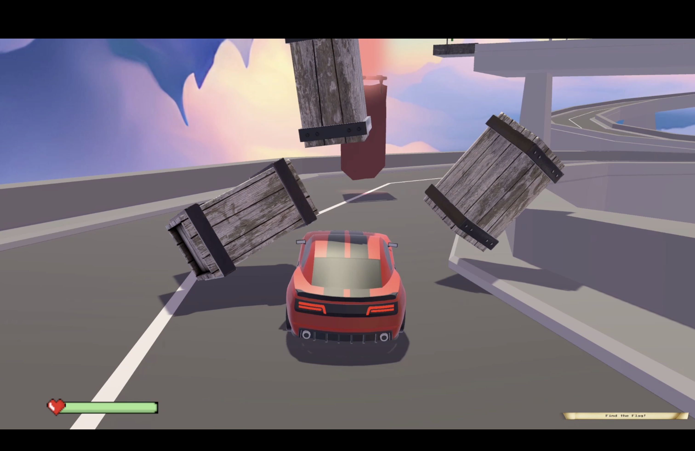
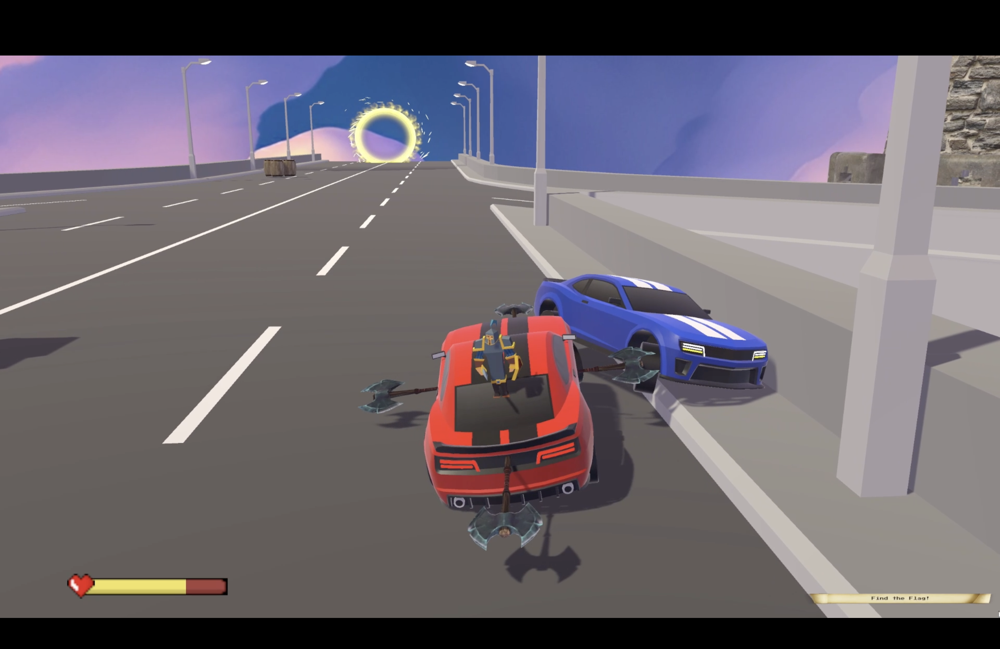
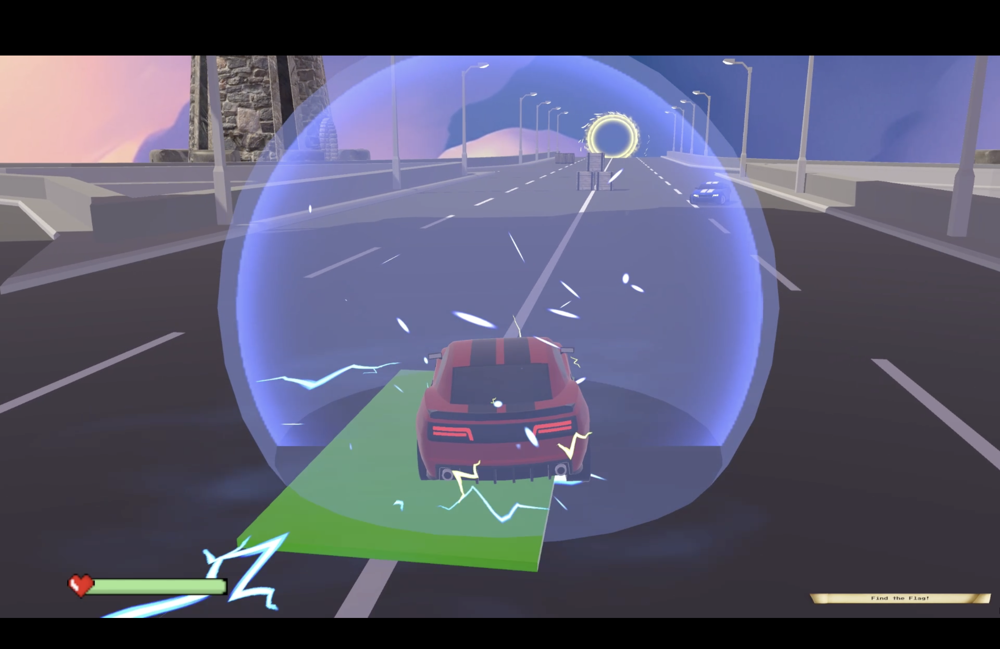
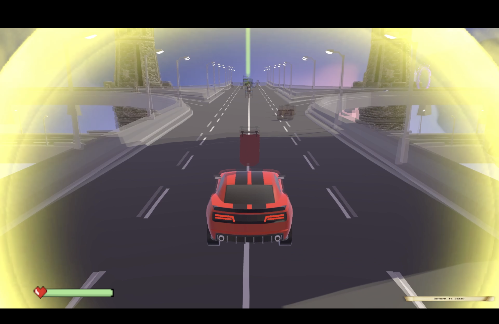
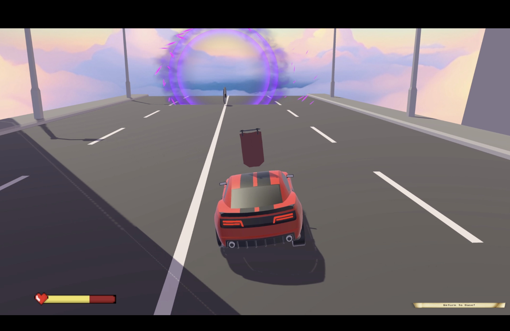
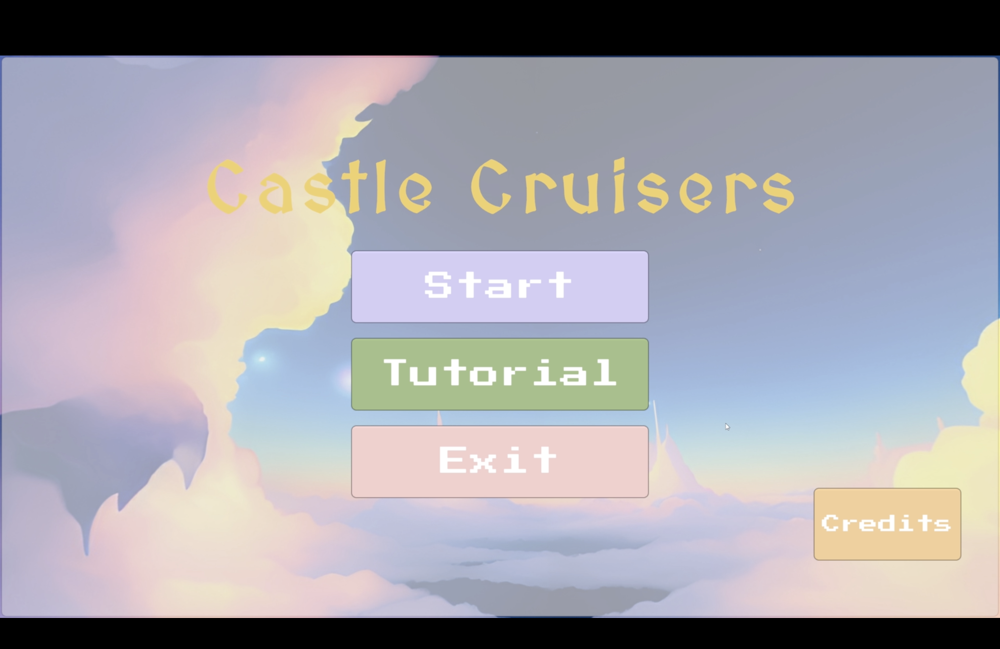

  

## Overview
Castle Cruisers is an objective-based 3D racing game (MacOS, Windows) with AI agents, simulated physics, and animations. It was a semester long group project for my [video game design](https://omscs.gatech.edu/cs-6457-video-game-design) class at Georgia Tech! We used the [Unity](https://unity.com/) and C#.

Each level has one goal: Capture the flag and return it to home base.

For an overview, [watch our gameplay trailer](https://youtu.be/tqgv4prsA3E)!

**NOTE:** The codebase remains private. Feel free to reach out if you want to learn more about how we built this app!

## Gameplay Features

### AI

Custom AI agents with multiple states of behavior serve as dynamic obstacles in your journey.

  

### Physics

Physics modeled after the real world make the game more immersive.

  

### Combat

Combat enables skill-based interactions with the environment. 

  

### Power-ups

Power-ups make gameplay more fun!

  

### Portals

Portals make gameplay more strategic!

  

  

### Tutorial Mode

A dynamic tutorial mode allows beginners to jump right in!

  

  

